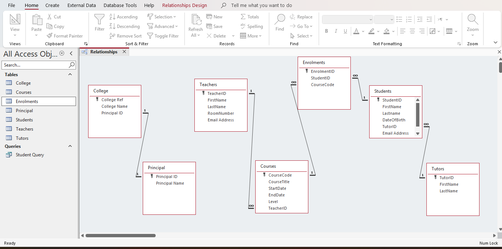
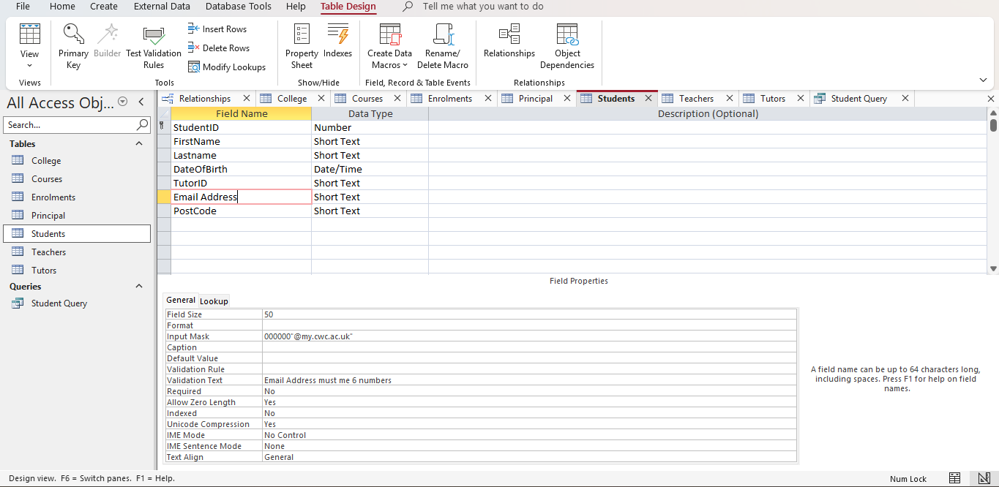
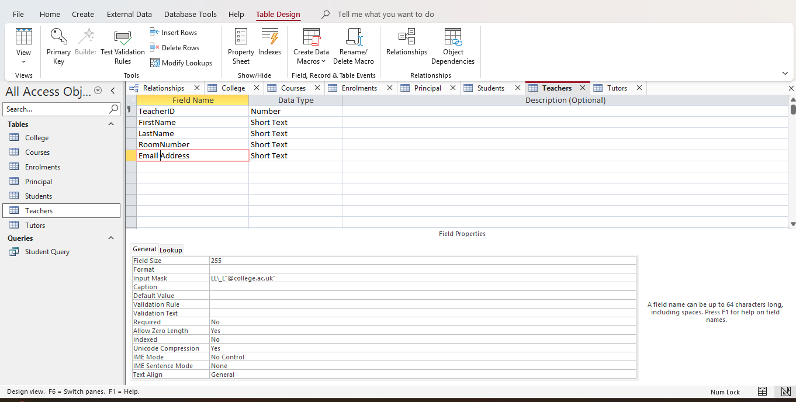
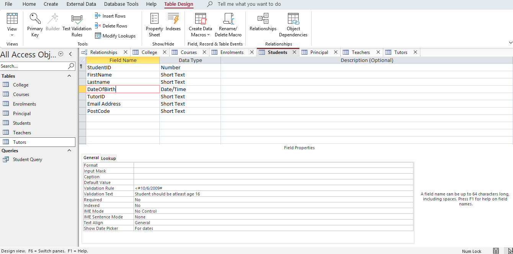
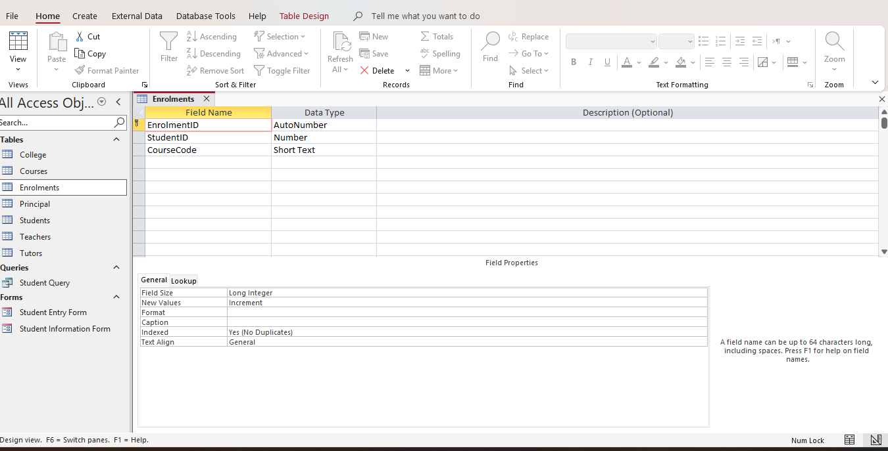
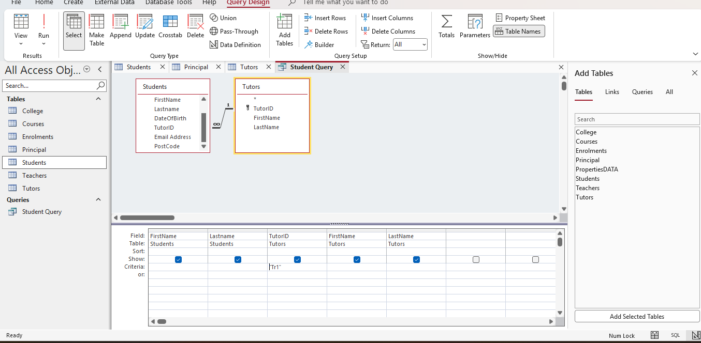
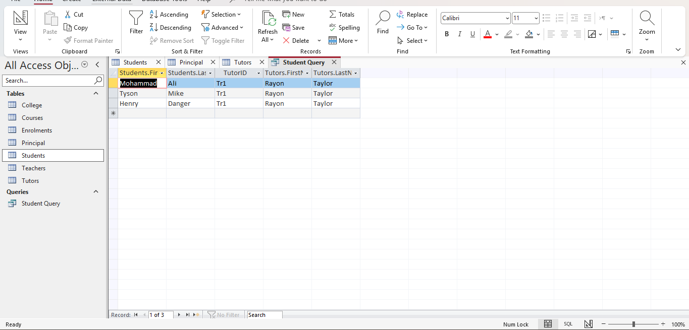
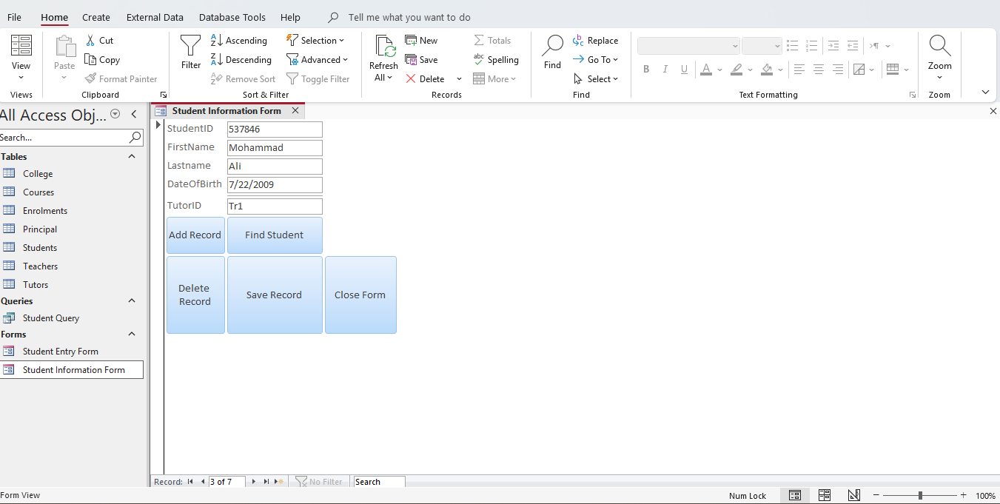
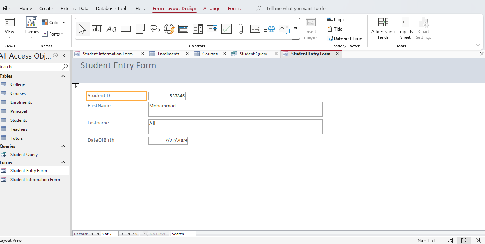

# Student Database Management System

A relational database built in Microsoft Access to manage a college's students, tutors, teachers, courses, and enrolments. The project models real-world academic relationships — including a many-to-many enrolment structure resolved through a proper junction table — and includes working data-entry forms and queries built on top of it.

## Overview

This system tracks:
- **Colleges** and their **Principals**
- **Teachers** and the **Courses** they run
- **Students**, their assigned **Tutors**, and the **Courses** they're enrolled in

The core design challenge was correctly modelling the relationship between students and courses — since a student can take multiple courses, and a course can have multiple students, this required a many-to-many relationship resolved through a dedicated junction table (`Enrolments`), rather than a direct link between the two tables.

## Entity Relationship Diagram

## Relationships summary

| Relationship | Type | Foreign Key |
|---|---|---|
| College ↔ Principal | One-to-One | `College.PrincipalID` → `Principal.PrincipalID` |
| Teachers ↔ Courses | One-to-Many | `Courses.TeacherID` → `Teachers.TeacherID` |
| Tutors ↔ Students | One-to-Many | `Students.TutorID` → `Tutors.TutorID` |
| Students ↔ Courses | Many-to-Many (via junction) | `Enrolments.StudentID` / `Enrolments.CourseCode` |

## Table design

**Students** — includes a validation rule enforcing a minimum age of 16 for enrolment.

**Teachers** — includes an input mask validating the format of college email addresses.

**Tutors**

**Enrolments** — the junction table resolving the many-to-many relationship between Students and Courses. Kept deliberately minimal: an AutoNumber primary key plus the two foreign keys needed to link a student to a course.

## Queries

A query joining Students and Tutors, filtered to show all students assigned to a specific tutor.

**Design view:**

**Results:**

## Forms

**Student Information Form** — a full data-entry form with navigation and record-management buttons (Add Record, Find Student, Delete Record, Save Record, Close Form), shown here populated with a real student record.

**Student Entry Form** — a simplified entry form for quick record creation.

## Tech used

- Microsoft Access (tables, relationships, queries, forms)
- Access Query Design (joins across multiple tables)
- Form design with bound controls and the Command Button Wizard for record navigation/operations

## Notes

This is a Microsoft Access database (`.accdb`), so it isn't runnable directly in a browser. The screenshots above document the full structure, relationships, and working functionality. The `.accdb` file itself is included in this repository for anyone with Microsoft Access installed who wants to open it directly.
